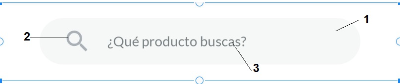

# Search Bar Static




## Color

1.- colorSurface  
2.- colorOnSurface  
3.- textColor  
4.- background

## Customization

**text**

```xml
    <attr name="android:text" />
    <attr name="android:textColor" />
    <attr name="android:textSize" />
    <attr name="android:textAlignment" />
    <attr name="android:fontFamily" />
    <attr name="android:typeface" />
    <attr name="android:textFontWeight" />
    <attr name="android:gravity" />
```

**Icon**

```xml
    <attr name="srcCompat" /> 
    <attr name="colorOnSurface"/>
```

**Bar**
```xml
    <attr name="colorSurface"/>
```


## Layout

[layout](https://github.com/Only-IceSoul/JJLayout)